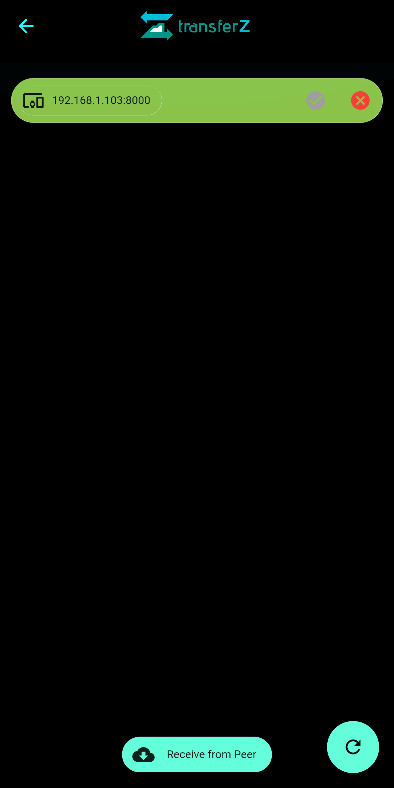
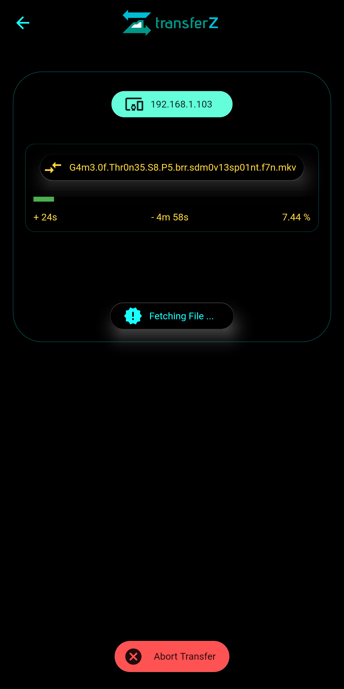

# transferz

A simple Android Application built with :heart: using Flutter, for transferring files between devices.

Putting :star: will be highly appreciated :smile: .

### Release
All releases can be found [here](https://github.com/itzmeanjan/transferZ/releases).

## Implementation Details

[Making of transferZ](https://dev.to/itzmeanjan/making-of-transferz-part-1-n-3mjf), an article series, which I started [here](https://dev.to/itzmeanjan), puts light on detailed implementation of *Client-Server* portion of *transferZ*.

Articles covering remaining sections coming soon :wink:. 

## App on Run

## Courtesy

Thanks to [Tobaloidee](https://github.com/Tobaloidee), for designing logo and icon for *transferZ* 

:heart:
